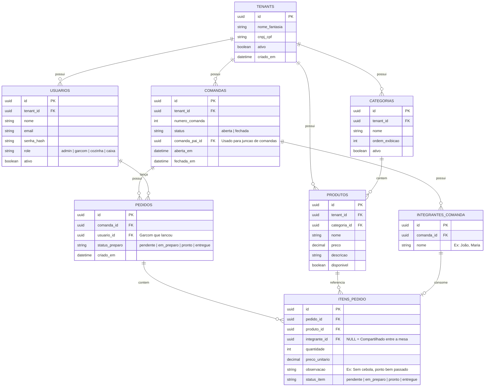

# 🗄️ Modelagem do Banco de Dados - PedMesa (DER)

Este documento descreve o modelo relacional do banco de dados do PedMesa.

## 1. Regras Globais de Arquitetura

- Multi-tenancy: Quase todas as tabelas operacionais possuem a coluna tenant_id (UUID), garantindo isolamento absoluto dos dados de cada estabelecimento/lanchonete desde a primeira versão.
- Divisão Inteligente de Conta: A tabela itens_pedido possui a coluna opcional integrante_id (FK para integrantes_comanda). Se for preenchida, o item pertence àquela pessoa específica; se for NULL, o item é compartilhado entre todos os integrantes da mesa/comanda.

---

## 2. Diagrama de Entidades e Relacionamentos (Mermaid)

---

## 3. Dicionário de Dados & Descrição dos Campos

### tenants (Estabelecimentos / Assinantes)

Armazena a empresa cadastrada no SaaS.

- id: Chave primária única (UUID).
- nome_fantasia: Nome do estabelecimento.

### usuarios (Colaboradores e Perfis)

- role: Define as permissões de acesso via RBAC (admin, garcom, cozinha, caixa).

### comandas (Gestão das Mesas)

- status: Controla se a mesa está em atendimento (aberta) ou se a conta foi quitada (fechada).
- comanda_pai_id: Coluna auto-relacionada usada para o Agrupamento/Junção de Comandas. Quando o caixa junta a comanda 05 na comanda 06, a 05 aponta o comanda_pai_id para o ID da 06.

### integrantes_comanda (Pessoas na Mesa)

Nomes cadastrados pelo garçom ao abrir a comanda (ex: João, Maria).

### itens_pedido (O Coração da Divisão de Conta)

- integrante_id:
  - Preenchido (UUID): O item é individual e será cobrado exclusivamente no extrato daquele integrante.
  - NULL: O item é coletivo (ex: Porção de Batatas, Jarra de Suco) e seu valor total será dividido entre todos os integrantes cadastrados na comanda no momento do fechamento.
