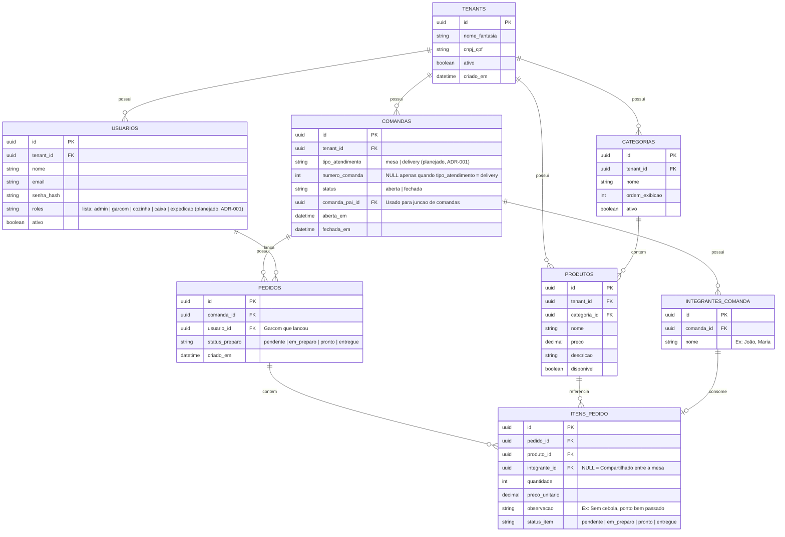
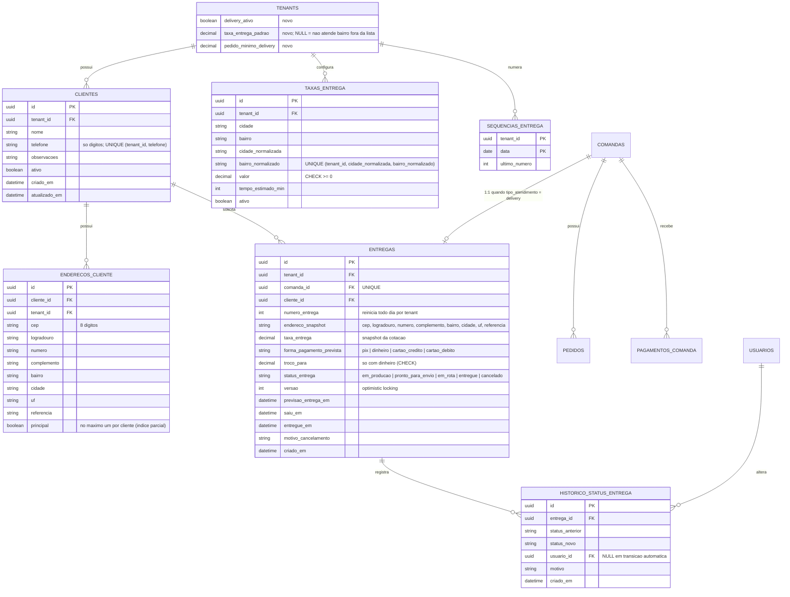

# 🗄️ Modelagem do Banco de Dados - PedMesa (DER)

Este documento descreve o modelo relacional do banco de dados do PedMesa.

## 1. Regras Globais de Arquitetura

- Multi-tenancy: Quase todas as tabelas operacionais possuem a coluna tenant_id (UUID), garantindo isolamento absoluto dos dados de cada estabelecimento/lanchonete desde a primeira versão.
- Divisão Inteligente de Conta: A tabela itens_pedido possui a coluna opcional integrante_id (FK para integrantes_comanda). Se for preenchida, o item pertence àquela pessoa específica; se for NULL, o item é compartilhado entre todos os integrantes da mesa/comanda.

---

## 2. Diagrama de Entidades e Relacionamentos (Mermaid)

```mermaid
erDiagram
TENANTS ||--o{ USUARIOS : possui
TENANTS ||--o{ CATEGORIAS : possui
TENANTS ||--o{ PRODUTOS : possui
TENANTS ||--o{ COMANDAS : possui

    CATEGORIAS ||--o{ PRODUTOS : contem

    COMANDAS ||--o{ INTEGRANTES_COMANDA : possui
    COMANDAS ||--o{ PEDIDOS : possui

    PEDIDOS ||--o{ ITENS_PEDIDO : contem
    PRODUTOS ||--o{ ITENS_PEDIDO : referencia
    INTEGRANTES_COMANDA ||--o| ITENS_PEDIDO : consome
    USUARIOS ||--o{ PEDIDOS : lança

    TENANTS {
        uuid id PK
        string nome_fantasia
        string cnpj_cpf
        boolean ativo
        datetime criado_em
    }

    USUARIOS {
        uuid id PK
        uuid tenant_id FK
        string nome
        string email
        string senha_hash
        string roles "lista: admin | garcom | cozinha | caixa | expedicao (planejado, ADR-001)"
        boolean ativo
    }

    CATEGORIAS {
        uuid id PK
        uuid tenant_id FK
        string nome
        int ordem_exibicao
        boolean ativo
    }

    PRODUTOS {
        uuid id PK
        uuid tenant_id FK
        uuid categoria_id FK
        string nome
        decimal preco
        string descricao
        boolean disponivel
    }

    COMANDAS {
        uuid id PK
        uuid tenant_id FK
        string tipo_atendimento "mesa | delivery (planejado, ADR-001)"
        int numero_comanda "NULL apenas quando tipo_atendimento = delivery"
        string status "aberta | fechada"
        uuid comanda_pai_id FK "Usado para juncao de comandas"
        datetime aberta_em
        datetime fechada_em
    }

    INTEGRANTES_COMANDA {
        uuid id PK
        uuid comanda_id FK
        string nome "Ex: João, Maria"
    }

    PEDIDOS {
        uuid id PK
        uuid comanda_id FK
        uuid usuario_id FK "Garcom que lancou"
        string status_preparo "pendente | em_preparo | pronto | entregue"
        datetime criado_em
    }

    ITENS_PEDIDO {
        uuid id PK
        uuid pedido_id FK
        uuid produto_id FK
        uuid integrante_id FK "NULL = Compartilhado entre a mesa"
        int quantidade
        decimal preco_unitario
        string observacao "Ex: Sem cebola, ponto bem passado"
        string status_item "pendente | em_preparo | pronto | entregue"
    }
```

### 2.1 Módulo Delivery (planejado, ADR-001)

Decisão e justificativa em `docs/adr/001-delivery-agregado-comanda.md`. O delivery é
uma **comanda** com `tipo_atendimento = delivery`, mais uma linha em `entregas` (1:1).
Itens, pedidos, pagamentos e fechamento reaproveitam as tabelas existentes.

```mermaid
erDiagram
    TENANTS ||--o{ CLIENTES : possui
    TENANTS ||--o{ TAXAS_ENTREGA : configura
    TENANTS ||--o{ SEQUENCIAS_ENTREGA : numera
    CLIENTES ||--o{ ENDERECOS_CLIENTE : possui
    CLIENTES ||--o{ ENTREGAS : solicita
    COMANDAS ||--o| ENTREGAS : "1:1 quando tipo_atendimento = delivery"
    COMANDAS ||--o{ PEDIDOS : possui
    COMANDAS ||--o{ PAGAMENTOS_COMANDA : recebe
    ENTREGAS ||--o{ HISTORICO_STATUS_ENTREGA : registra
    USUARIOS ||--o{ HISTORICO_STATUS_ENTREGA : altera

    TENANTS {
        boolean delivery_ativo "novo"
        decimal taxa_entrega_padrao "novo; NULL = nao atende bairro fora da lista"
        decimal pedido_minimo_delivery "novo"
    }

    CLIENTES {
        uuid id PK
        uuid tenant_id FK
        string nome
        string telefone "so digitos; UNIQUE (tenant_id, telefone)"
        string observacoes
        boolean ativo
        datetime criado_em
        datetime atualizado_em
    }

    ENDERECOS_CLIENTE {
        uuid id PK
        uuid cliente_id FK
        uuid tenant_id FK
        string cep "8 digitos"
        string logradouro
        string numero
        string complemento
        string bairro
        string cidade
        string uf
        string referencia
        boolean principal "no maximo um por cliente (indice parcial)"
    }

    TAXAS_ENTREGA {
        uuid id PK
        uuid tenant_id FK
        string cidade
        string bairro
        string cidade_normalizada
        string bairro_normalizado "UNIQUE (tenant_id, cidade_normalizada, bairro_normalizado)"
        decimal valor "CHECK >= 0"
        int tempo_estimado_min
        boolean ativo
    }

    ENTREGAS {
        uuid id PK
        uuid tenant_id FK
        uuid comanda_id FK "UNIQUE"
        uuid cliente_id FK
        int numero_entrega "reinicia todo dia por tenant"
        string endereco_snapshot "cep, logradouro, numero, complemento, bairro, cidade, uf, referencia"
        decimal taxa_entrega "snapshot da cotacao"
        string forma_pagamento_prevista "pix | dinheiro | cartao_credito | cartao_debito"
        decimal troco_para "so com dinheiro (CHECK)"
        string status_entrega "em_producao | pronto_para_envio | em_rota | entregue | cancelado"
        int versao "optimistic locking"
        datetime previsao_entrega_em
        datetime saiu_em
        datetime entregue_em
        string motivo_cancelamento
        datetime criado_em
    }

    SEQUENCIAS_ENTREGA {
        uuid tenant_id PK
        date data PK
        int ultimo_numero
    }

    HISTORICO_STATUS_ENTREGA {
        uuid id PK
        uuid entrega_id FK
        string status_anterior
        string status_novo
        uuid usuario_id FK "NULL em transicao automatica"
        string motivo
        datetime criado_em
    }
```

---

## 3. Dicionário de Dados & Descrição dos Campos

### tenants (Estabelecimentos / Assinantes)

Armazena a empresa cadastrada no SaaS.

- id: Chave primária única (UUID).
- nome_fantasia: Nome do estabelecimento.

### usuarios (Colaboradores e Perfis)

- role: Define as permissões de acesso via RBAC (admin, garcom, cozinha, caixa).

### comandas (Gestão das Mesas e dos Pedidos Delivery)

- tipo_atendimento (planejado, ADR-001): `mesa` ou `delivery`. É a fonte da verdade do tipo; pedidos e itens herdam pelo relacionamento com a comanda.
- numero_comanda: Número da mesa. Obrigatório para `mesa` e NULL para `delivery` (garantido por CHECK). Delivery usa `entregas.numero_entrega`.
- status: Controla se a mesa está em atendimento (aberta) ou se a conta foi quitada (fechada).
- comanda_pai_id: Coluna auto-relacionada usada para o Agrupamento/Junção de Comandas. Quando o caixa junta a comanda 05 na comanda 06, a 05 aponta o comanda_pai_id para o ID da 06.

### integrantes_comanda (Pessoas na Mesa)

Nomes cadastrados pelo garçom ao abrir a comanda (ex: João, Maria).

### itens_pedido (O Coração da Divisão de Conta)

- integrante_id:
  - Preenchido (UUID): O item é individual e será cobrado exclusivamente no extrato daquele integrante.
  - NULL: O item é coletivo (ex: Porção de Batatas, Jarra de Suco) e seu valor total será dividido entre todos os integrantes cadastrados na comanda no momento do fechamento.

### Tabelas do módulo Delivery (planejadas, ADR-001)

- **clientes**: Cliente do delivery, identificado pelo telefone (só dígitos, com DDD) dentro do tenant.
- **enderecos_cliente**: Endereços salvos do cliente. No máximo um `principal`, que vem pré-selecionado no formulário.
- **taxas_entrega**: Taxa de frete por bairro. As colunas `*_normalizado` (minúsculas, sem acento) permitem casar o bairro devolvido pelo ViaCEP com o cadastrado. Bairro fora da lista usa `tenants.taxa_entrega_padrao` ou não é atendido.
- **entregas**: Dados que só existem no delivery, 1:1 com a comanda. O endereço e a taxa são **cópias** do momento do pedido, e editar o cadastro do cliente não altera entregas passadas. O troco a devolver não é gravado; ele é derivado de `troco_para` e do total atual.
- **sequencias_entrega**: Contador do `numero_entrega` por tenant e por dia, incrementado de forma atômica (`INSERT … ON CONFLICT DO UPDATE … RETURNING`).
- **historico_status_entrega**: Trilha append-only das transições de status da entrega, usada para auditoria e métricas de tempo.
